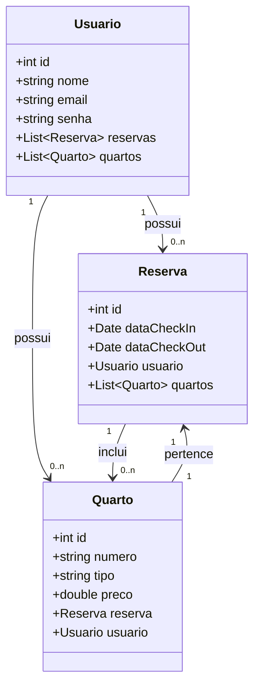

```mermaid
classDiagram
    Usuario "1" --> "0..n" Reserva : possui
    Usuario "1" --> "0..n" Quarto : possui
    Reserva "1" --> "0..n" Quarto : inclui
    Quarto "1" --> "1" Reserva : pertence
    class Usuario {
        +int id
        +string nome
        +string email
        +string senha
        +List~Reserva~ reservas
        +List~Quarto~ quartos
    }
    class Reserva {
        +int id
        +Date dataCheckIn
        +Date dataCheckOut
        +Usuario usuario
        +List~Quarto~ quartos
    }
    class Quarto {
        +int id
        +string numero
        +string tipo
        +double preco
        +Reserva reserva
        +Usuario usuario
    }
```